# Transformer 架构学习指南

> 本项目通过一个**情感分析（Sentiment Analysis）** 任务场景，从零演示 Transformer 架构中每一个模块的设计思想、数据流动过程和代码实现。适合作为 Transformer 入门学习资料。
>
> 参考资料：https://hello-agents.datawhale.cc/#/./chapter3/%E7%AC%AC%E4%B8%89%E7%AB%A0%20%E5%A4%A7%E8%AF%AD%E8%A8%80%E6%A8%A1%E5%9E%8B%E5%9F%BA%E7%A1%80?id=_312-transformer-%e6%9e%b6%e6%9e%84%e8%a7%a3%e6%9e%90

---

## 目录

1. [项目结构](#1-项目结构)
2. [场景设定：什么是情感分析](#2-场景设定什么是情感分析)
3. [整体数据流程](#3-整体数据流程)
4. [模块详解](#4-模块详解)
   - [4.1 词嵌入层 (Embedding)](#41-词嵌入层-embedding)
   - [4.2 位置编码 (Positional Encoding)](#42-位置编码-positional-encoding)
   - [4.3 多头注意力 (Multi-Head Attention)](#43-多头注意力-multi-head-attention)
   - [4.4 位置前馈网络 (Position-wise Feed-Forward)](#44-位置前馈网络-position-wise-feed-forward)
   - [4.5 编码器层 (Encoder Layer)](#45-编码器层-encoder-layer)
   - [4.6 解码器层 (Decoder Layer)](#46-解码器层-decoder-layer)
5. [Transformer 的核心优势](#5-transformer-的核心优势)
6. [运行指南](#6-运行指南)
7. [扩展方向](#7-扩展方向)

---

## 1. 项目结构

```tree
Transformer-demo/
├── app.py                        # 演示主程序（完整示例代码）
└── transformer/                  # Transformer 核心模块包
    ├── __init__.py               # 包导出接口
    ├── embedding.py              # 位置编码 (PositionalEncoding)
    ├── attention.py              # 多头注意力 (MultiHeadAttention)
    ├── feedforward.py            # 位置前馈网络 (PositionWiseFeedForward)
    ├── encoder.py                # 编码器层 (EncoderLayer)
    └── decoder.py                # 解码器层 (DecoderLayer)
```

每个模块各司其职，后文会逐一说明它们**分别负责什么**、**为什么需要它**。

---

## 2. 场景设定：什么是情感分析

**情感分析**是自然语言处理（NLP）中的经典任务：给定一段文本，判断其情感倾向是正面还是负面。

**输入例子：**
```
"This movie is amazing and I really enjoyed it!"
  → 模型预测: 正面 (Positive)

"The film was terrible, boring and a waste of time."
  → 模型预测: 负面 (Negative)
```

**为什么选择情感分析作为演示场景？**

- 任务简单直观：输入文本 → 输出正/负，好理解模型"在做什么"
- 天然覆盖 Transformer 的核心能力：理解序列中词与词之间的关系
- 真实应用广泛：电商评论分析、社交媒体舆情监控等

---

## 3. 整体数据流程

下面这张图展示了数据在 Transformer 中的完整流动过程：


**关键理解**：Transformer 的工作可以概括为两步——**理解**（编码器理解句子内容）和**决策**（分类头做出判断）。下面的模块详解将逐一拆解每一步是如何实现的。

---

## 4. 模块详解

### 4.1 词嵌入层 (Embedding)

**代码位置**: `app.py` 第 95 行，`TransformerEncoder.__init__()` 中

```python
self.embedding = nn.Embedding(vocab_size, d_model)
```

#### 这个模块负责什么？

将**离散的单词符号**转换为**连续的数值向量**。计算机无法直接处理 "amazing" 这样的字符串，必须先将它们变成数字。

#### 为什么需要它？

神经网络本质上是数值计算。词嵌入是 NLP 深度学习的基础——它将词映射到一个连续的向量空间，让语义相似的词在空间中距离更近：

```
词表中的词 (vocab_size = 10000)
    ↓
每个词对应一个 d_model 维的向量 (本项目 d_model = 64)
    ↓
"amazing"  →  [0.12, -0.45, 0.78, ...]  (64 个数字)
"wonderful"→  [0.15, -0.42, 0.82, ...]  (与 amazing 相似的向量)
"table"    →  [1.23, 0.67, -0.11, ...]  (与 amazing 距离较远的向量)
```

#### 数据形状变化

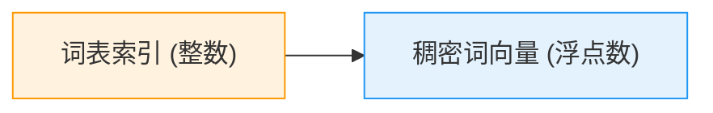

---

### 4.2 位置编码 (Positional Encoding)

**代码位置**: `transformer/embedding.py`

```python
class PositionalEncoding(nn.Module):
    def __init__(self, d_model, dropout=0.1, max_len=5000):
        position = torch.arange(max_len).unsqueeze(1)
        div_term = torch.exp(torch.arange(0, d_model, 2) * (-math.log(10000.0) / d_model))
        pe = torch.zeros(max_len, d_model)
        pe[:, 0::2] = torch.sin(position * div_term)
        pe[:, 1::2] = torch.cos(position * div_term)
        self.register_buffer('pe', pe.unsqueeze(0))

    def forward(self, x):
        x = x + self.pe[:, :x.size(1)]
        return self.dropout(x)
```

#### 这个模块负责什么？

**为每个位置注入独特的"门牌号"**，让 Transformer 知道序列中谁在第几个位置。

#### 为什么需要它？（核心问题）

Transformer 的自注意力机制在计算词与词之间的关系时，**对位置是完全无感的**——注意力分数只取决于词的语义内容，与它们在句子中哪个位置出现毫无关系。

**具体表现**：

- "This movie is amazing" 和 "Amazing is movie This" 送入注意力机制后，得到的结果完全相同
- 这显然不合理——语言是有序的，"主语" 通常在"谓语"之前

#### 解决方案

用正弦/余弦函数为每个位置生成一个独特的向量，与词嵌入相加：

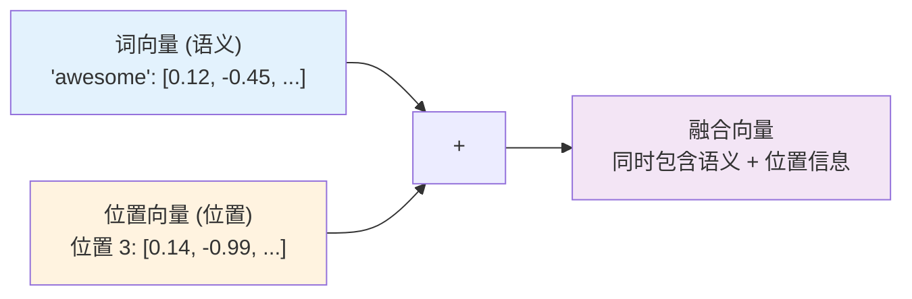

**数学公式**：

```
PE(pos, 2i)   = sin(pos / 10000^(2i/d_model))
PE(pos, 2i+1) = cos(pos / 10000^(2i/d_model))
```

**为什么用 sin/cos？** 三个原因：

| 设计选择 | 原因 |
|---------|------|
| **每个位置独一无二** | sin/cos 的频率不同，每个位置产生的向量不同 |
| **相对位置可推导** | `sin(A+B)` 可以写成 `sin(A)` 和 `cos(A)` 的线性组合，模型容易学到相对位置关系 |
| **不占参数** | 预计算好直接加上去，无需训练，节省显存 |

#### 数据形状变化

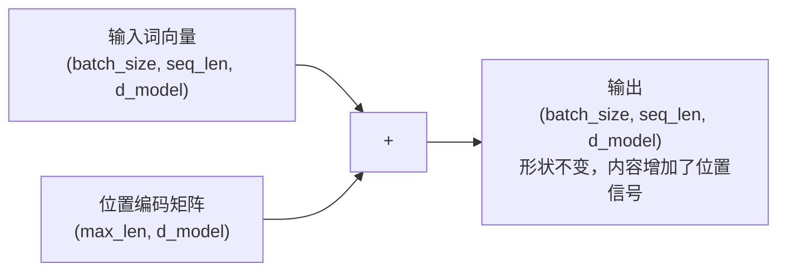

---

### 4.3 多头注意力 (Multi-Head Attention)

**代码位置**: `transformer/attention.py`

这是 Transformer 中**最核心**的模块，理解了它就理解了 Transformer 一半以上的设计思想。

#### 这个模块负责什么？

让序列中的每个词都能**"看到"其他所有词**，判断谁与谁相关、相关程度如何，从而理解上下文语义。

#### 为什么需要它？（核心问题）

自然语言中，一个词的意思往往取决于上下文：

- "The **bank** of the river" — **bank** 指河岸
- "The **bank** offers low interest rates" — **bank** 指银行

注意力机制就是解决这个问题的：让模型学会判断每个词应该关注序列中的哪些其他词。

#### Q, K, V 三元组：如何理解

| 符号 | 全称 | 中文解释 | 形象比喻 |
|------|------|---------|---------|
| **Q** | Query（查询） | "我在找什么信息" | 图书馆里拿着搜索词的你 |
| **K** | Key（键） | "我能提供什么信息" | 每本书背面的关键词索引 |
| **V** | Value（值） | "信息的实际内容" | 每本书的实际内容 |

**匹配过程**：用 Q（你的问题）去匹配所有 K（书的关键词），找到最相关的书，然后用相似度作为权重，对 V（书的内容）加权求和。

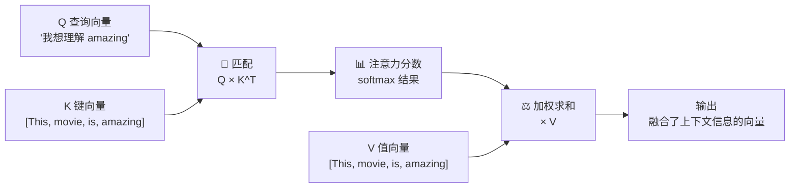

#### 缩放点积注意力（公式）

```python
Attention(Q, K, V) = softmax(QK^T / √d_k) × V
```

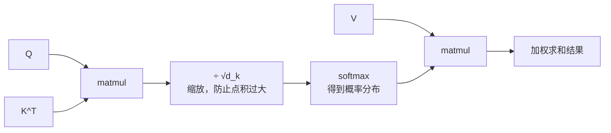

**为什么要除以 √d_k？**

当 d_k 较大时，Q·K 的点积结果数值也会变大，可能导致 Softmax 进入**饱和区**（输出接近 one-hot，梯度接近零），训练困难。除以 √d_k 可以将方差控制在合理范围内。

#### 单头 vs 多头

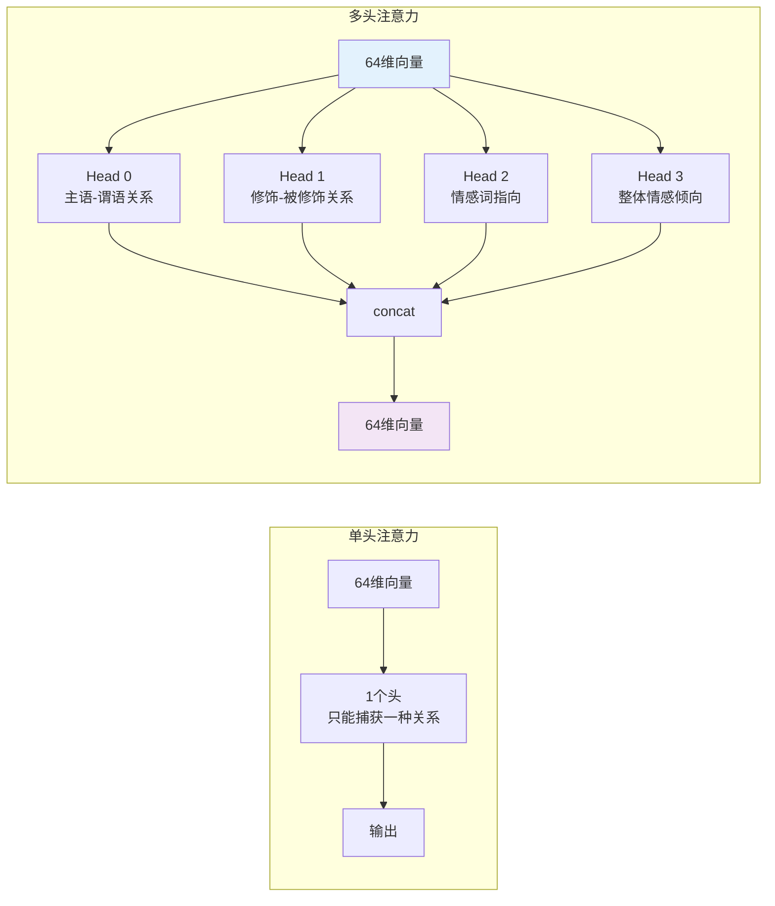

**多头的优势**：将 d_model 分成多个子空间并行计算注意力，每个头可以关注不同类型的关系，然后拼接在一起输出。

#### 自注意力的实际效果

以句子 **"This movie is really amazing!"** 为例，"amazing" 在自注意力中与其他词的关联程度：

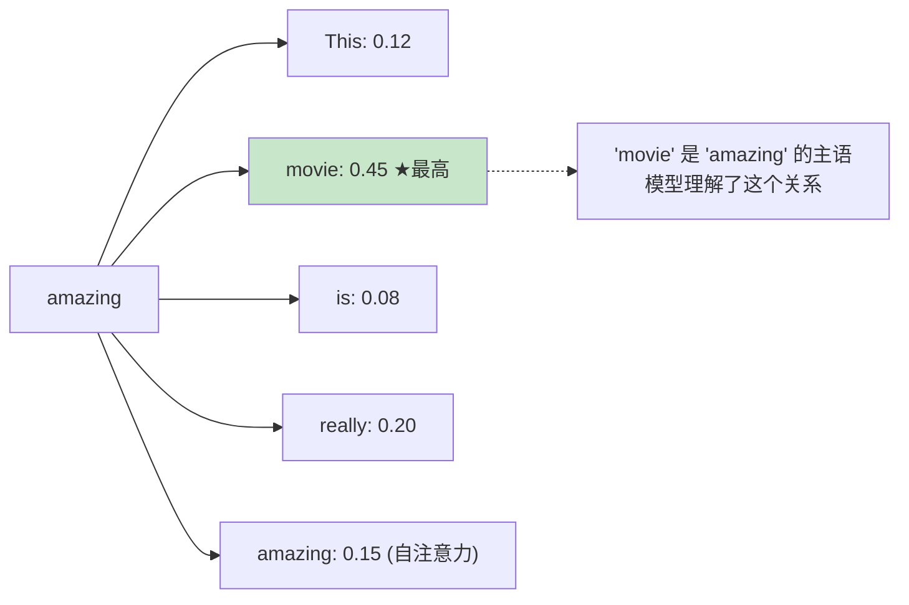

这意味着"amazing"的输出向量中融合了"movie"的信息——模型理解了**什么是"amazing"的**。

---

### 4.4 位置前馈网络 (Position-wise Feed-Forward)

**代码位置**: `transformer/feedforward.py`

```python
class PositionWiseFeedForward(nn.Module):
    def __init__(self, d_model, d_ff, dropout=0.1):
        self.linear1 = nn.Linear(d_model, d_ff)  # 64 → 128
        self.linear2 = nn.Linear(d_ff, d_model)  # 128 → 64

    def forward(self, x):
        x = self.linear1(x)
        x = nn.ReLU()(x)
        x = self.dropout(x)
        x = self.linear2(x)
        return x
```

#### 这个模块负责什么？

对序列中**每个位置的向量独立**做非线性变换和特征提取，进一步处理来自注意力层的输出。

#### 为什么需要它？（与注意力的分工）

注意力机制负责**"词与词之间的关系"**（如 "amazing" 和 "movie" 谁与谁相关），但它输出的向量本身表达能力有限——还需要一个网络来**提炼每个位置的语义**。

前馈网络的作用：

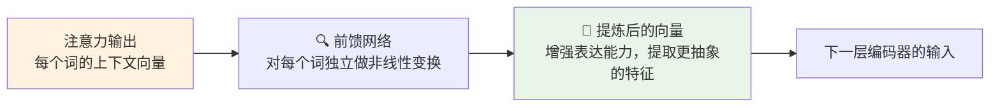

**网络结构**是一个两层的全连接网络，中间有 ReLU 激活：

```
64维输入 → Linear(64→128) → ReLU → Dropout → Linear(128→64) → 64维输出
```

d_ff 通常是 d_model 的 2~4 倍（如 64→256），提供更大的容量来存储和提炼信息。

---

### 4.5 编码器层 (Encoder Layer)

**代码位置**: `transformer/encoder.py`

```python
class EncoderLayer(nn.Module):
    def __init__(self, d_model, num_heads, d_ff, dropout=0.1):
        self.self_attn = MultiHeadAttention(d_model, num_heads)
        self.feed_forward = PositionWiseFeedForward(d_model, d_ff, dropout)
        self.norm1 = nn.LayerNorm(d_model)
        self.norm2 = nn.LayerNorm(d_model)
        self.dropout = nn.Dropout(dropout)
```

#### 这个模块负责什么？

编码器层是 Transformer 的**核心计算单元**，它将"词向量 + 位置信息"经过注意力交互和前馈变换，输出"**带有上下文理解的语义向量**"。

#### 为什么需要它？（整体作用）

如果说词嵌入是"查字典"（每个词查到自己的解释），编码器层就是"**开研讨会**"——每个词向量在会上发言、倾听、融合其他人的意见，最终带着集体智慧离开。

#### 内部结构

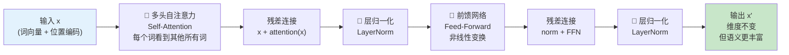

**两个关键设计**：

**残差连接**（Residual Connection）：`output = x + sublayer(x)`

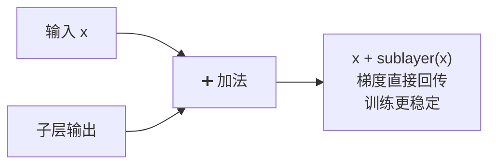

- 让梯度能够跨层传递，防止深层网络训练困难
- 理论上至少保证：深层不会比浅层差

**层归一化**（Layer Normalization）：对每个样本的每个位置做均值归一化

- 稳定训练过程，加速收敛
- 稳定每层的数值范围

#### 多层堆叠的效果

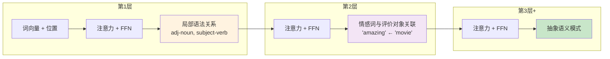

每增加一层，模型对语义的理解就更深入一层。BERT 使用 12 层，BERT-Large 使用 24 层。

---

### 4.6 解码器层 (Decoder Layer)

**代码位置**: `transformer/decoder.py`

```python
class DecoderLayer(nn.Module):
    def __init__(self, d_model, num_heads, d_ff, dropout=0.1):
        self.self_attn = MultiHeadAttention(d_model, num_heads)   # 掩码自注意力
        self.cross_attn = MultiHeadAttention(d_model, num_heads)  # 交叉注意力
        self.feed_forward = PositionWiseFeedForward(d_model, d_ff, dropout)
```

#### 这个模块负责什么？

解码器用于**序列到序列（Seq2Seq）** 任务，典型场景是**机器翻译**（输入一句英文，输出一句法文）。它负责**根据编码器的理解，逐步生成目标序列**。

#### 为什么需要它？

情感分析只需要理解，不需要生成，用编码器就够了。但如果要做翻译、摘要、问答等**生成式任务**，就需要解码器：

- **编码器**负责"读懂"源语言："I love this movie"
- **解码器**负责"说出"目标语言："J'adore ce film"

#### 三个子层的作用

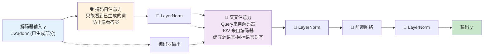

| 子层 | 注意力类型 | 作用 |
|------|-----------|------|
| **1** | 掩码自注意力 (Masked Self-Attention) | 解码器自身只能看到**已生成**的词，不能"偷看"还未生成的词 |
| **2** | 交叉注意力 (Cross-Attention) | 解码器的 Query 与编码器的 Key/Value 交互，建立**源语言→目标语言**的对齐关系 |
| **3** | 前馈网络 | 对每个位置的向量做非线性变换 |

#### 掩码机制详解

以翻译任务为例：

```
源语言 (英文):  "I love this movie"
目标语言 (法文): "J' ___ ___ ___ ___"  (正在逐步生成)

生成第3个词时：
  ✅ 已生成: "J'"  "adore"  → 可以看到
  ❌ 未生成: "ce"  "film"   → 不能看到（用掩码遮住）
```

这个掩码机制确保了解码器的**自回归**特性——在训练时也模拟这个过程，让模型学会逐步生成。

---

## 5. Transformer 的核心优势

### 5.1 为什么注意力机制如此强大？

传统 RNN 必须**从头到尾顺序传递信息**，才能建立远距离依赖：

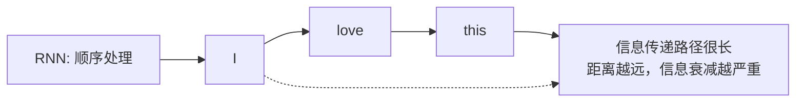

Transformer 则任意两个位置之间**直接建立连接**，不受距离限制：

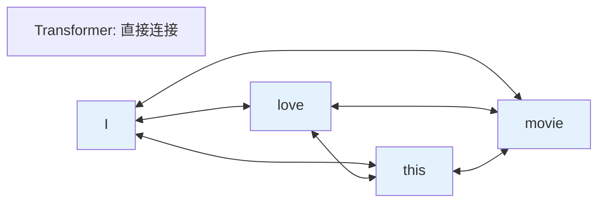

### 5.2 与传统模型对比

| 特性 | RNN/LSTM | TextCNN | **Transformer** |
|------|----------|---------|-----------------|
| **并行能力** | 差（必须顺序处理） | 好 | **优秀**（完全并行） |
| **远距离依赖** | 弱（路径长度 = O(n)） | 弱（卷积核小） | **强**（O(1) 路径） |
| **捕获关系** | 只能依赖顺序 | 局部 N-gram | **任意位置** |
| **可解释性** | 低 | 中 | **高**（注意力权重可视化） |

### 5.3 Transformer 架构的三大流派

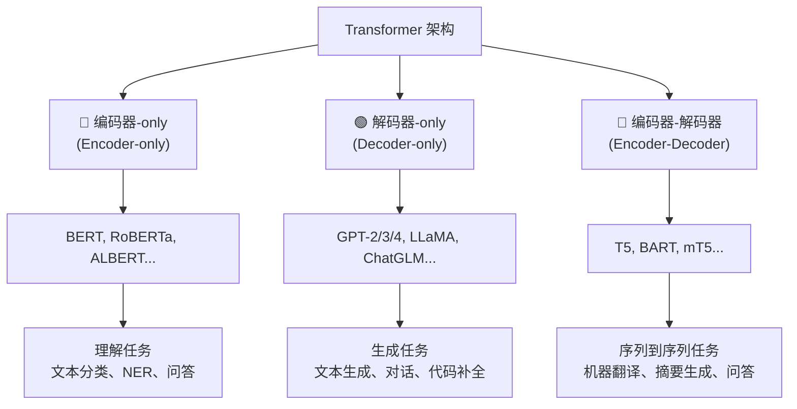

---

## 6. 运行指南

### 6.1 环境要求

```bash
pip install torch
```

### 6.2 运行演示

```bash
cd Transformer-demo
python app.py
```

### 6.3 预期输出

运行后分为 6 个步骤：

| 步骤 | 内容 |
|------|------|
| **步骤 1** | 打印模型参数量（707,009）和超参数 |
| **步骤 2** | 展示输入数据的形状和含义 |
| **步骤 3** | 完整前向传播，输出情感概率 |
| **步骤 4** | 分步追踪 tensor 形状变化（词嵌入→位置编码→编码器→池化→分类） |
| **步骤 5** | 解释注意力机制的工作原理 |
| **步骤 6** | Transformer vs 传统模型的对比 |

> **注意**：演示使用的是**随机初始化**的模型（未训练），准确率接近 50% 是正常的。真实场景中需要在大量语料上训练才能获得有意义的预测结果。

---

## 7. 扩展方向

### 7.1 模型扩展

- [ ] **完整 Transformer**：添加解码器，实现机器翻译
- [ ] **增加层数**：从 2 层扩展到 6 层（接近 BERT 规模）
- [ ] **可学习位置编码**：用 `nn.Embedding` 替代固定 sin/cos 编码
- [ ] **RoPE / ALiBi**：现代 LLM 使用的先进位置编码方法

### 7.2 任务扩展

- [ ] **机器翻译**：Encoder-Decoder + 交叉熵损失
- [ ] **文本生成**：Decoder-only，实现 GPT 风格语言模型
- [ ] **BERT 预训练**：Masked Language Model + Next Sentence Prediction

### 7.3 工程扩展

- [ ] **注意力可视化**：将 attention weights 绘制为热力图
- [ ] **模型训练**：在 IMDB 影评数据集上训练情感分析模型
- [ ] **参数效率**：实现 LoRA 等轻量微调方法

---

## 参考资料

| 资料 | 链接 |
|------|------|
| Attention Is All You Need（原始论文） | https://arxiv.org/abs/1706.03762 |
| The Illustrated Transformer（图解教程） | https://jalammar.github.io/illustrated-transformer/ |
| PyTorch 官方 Transformer 教程 | https://pytorch.org/tutorials/beginner/translation_transformer.html |
| Harvard NLP Annotated Transformer | http://nlp.seas.harvard.edu/annotated-transformer/ |
