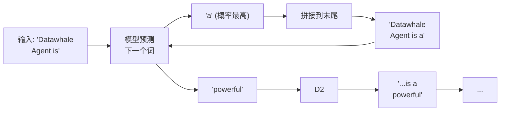
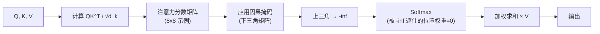
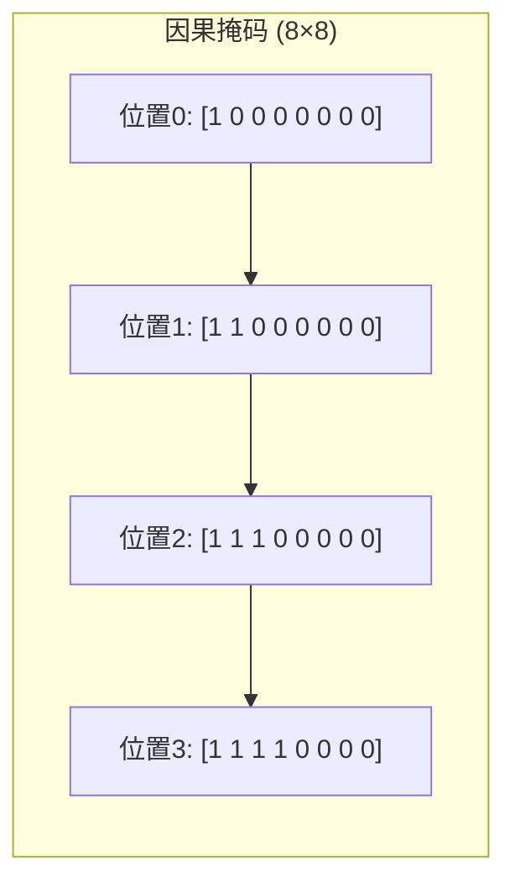
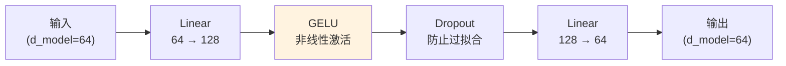
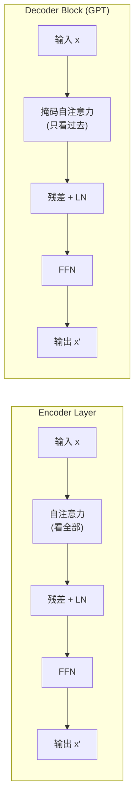
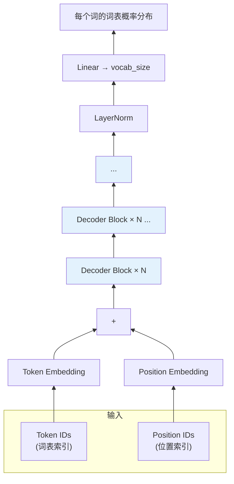
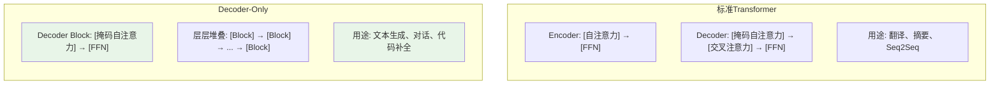

# Decoder-Only 架构 (GPT) 学习指南

> 本文档介绍 Decoder-Only（解码器专用）架构的设计思想、代码实现，以及它与标准 Transformer 的区别。

---

## 目录

1. [核心思想：从"理解"到"预测"](#1-核心思想从理解到预测)
2. [项目结构](#2-项目结构)
3. [自回归生成原理](#3-自回归生成原理)
4. [模块详解](#4-模块详解)
   - [4.1 CausalSelfAttention (掩码自注意力)](#41-causalselfattention-掩码自注意力)
   - [4.2 FeedForward (前馈网络)](#42-feedforward-前馈网络)
   - [4.3 TransformerBlock (解码器块)](#43-transformerblock-解码器块)
   - [4.4 GPTModel (主模型)](#44-gptmodel-主模型)
5. [与标准 Transformer 的对比](#5-与标准-transformer-的对比)
6. [运行指南](#6-运行指南)
7. [扩展方向](#7-扩展方向)

---

## 1. 核心思想：从"理解"到"预测"

**标准 Transformer 的思路**："先理解，再生成"——用编码器理解整个句子，再由解码器生成翻译。

**Decoder-Only 的思路**："语言的核心任务，不就是预测下一个最有可能出现的词吗？"

这个看似简单的转变带来了巨大的成功：

| 对比维度 | 标准 Transformer | Decoder-Only (GPT) |
|---------|-----------------|-------------------|
| **核心任务** | 理解 + 生成 | 预测下一个词 |
| **结构** | Encoder + Decoder | 只需要 Decoder |
| **注意力** | 全可见 + 掩码 + 交叉 | 只有掩码自注意力 |
| **预训练目标** | 多种任务目标 | 统一的 Next Token Prediction |
| **代表性模型** | T5, BART | GPT 系列, LLaMA, ChatGLM |
| **典型应用** | 翻译、摘要 | 对话、写作、代码生成 |

---

## 2. 项目结构

```tree
gpt/
├── __init__.py                # 包导出接口
├── causal_attention.py         # 掩码自注意力 (CausalSelfAttention)
├── feedforward.py              # 前馈网络 (FeedForward)
├── transformer_block.py        # Decoder Block (TransformerBlock)
├── gpt_model.py                 # GPT 主模型 (GPTModel)
app_gpt.py                      # 演示主程序
```

---

## 3. 自回归生成原理

**自回归（Autoregressive）** 听起来专业，其实就是一个简单的"文字接龙"游戏：



**生成过程**：

```
第 1 步: 输入 [Start]                    → 预测 "Hello"
第 2 步: 输入 [Start] Hello              → 预测 "world"
第 3 步: 输入 [Start] Hello world        → 预测 "!"
第 4 步: 输入 [Start] Hello world !      → 预测 [Stop] (停止)
```

---

## 4. 模块详解

### 4.1 CausalSelfAttention (掩码自注意力)

**代码位置**: `gpt/causal_attention.py`

#### 这个模块负责什么？

实现**掩码自注意力机制**——让每个位置只能看到当前位置及之前的内容，遮住未来的词。

#### 为什么需要它？（核心问题）

如果训练时不遮住未来词，模型会"作弊"：在预测第 3 个词时，如果能看到第 4、5 个词，模型直接复制就行，没有真正学会语言规律。

#### 实现原理



**因果掩码矩阵示意**（seq_len=8）：



**数学公式**：

```
标准注意力: Attention(Q,K,V) = softmax(QK^T / √d_k) × V
掩码注意力: Attention_masked(Q,K,V) = softmax(QK^T / √d_k + M) × V

其中 M 是掩码矩阵:
  M[i,j] = 0  (j > i, 未来位置) → 设为 -∞
  M[i,j] = 0  (j ≤ i, 历史位置) → 保持不变
```

#### 与 Encoder 自注意力的关键区别

| 特性 | Encoder 自注意力 | Decoder 掩码自注意力 |
|------|-----------------|-------------------|
| 每个位置能看到 | 所有位置（前后都可见） | 只有当前位置及之前 |
| 掩码 | 不需要 | **必须**（下三角掩码） |
| 用于 | 理解输入序列 | 生成（预测下一个词） |

---

### 4.2 FeedForward (前馈网络)

**代码位置**: `gpt/feedforward.py`

#### 这个模块负责什么？

对每个位置独立做非线性变换，提炼来自注意力层的信息，增强模型表达能力。

#### 为什么需要它？

注意力机制本质上是"加权求和"——它重新组织信息，但向量本身不做非线性变换。
如果没有前馈网络，无论堆叠多少层注意力，网络都只能做线性变换。
前馈网络通过 ReLU/GELU 激活函数，提供了真正的非线性表达能力。

#### 网络结构



---

### 4.3 TransformerBlock (解码器块)

**代码位置**: `gpt/transformer_block.py`

#### 这个模块负责什么？

将**掩码自注意力**和**前馈网络**组合在一起，是构建 GPT 的基础单元。

#### 与 Encoder Layer 的区别



**关键区别**：Decoder Block 比 Encoder Layer **少了一个交叉注意力层**。

- Encoder Layer: `[自注意力] → [交叉注意力] → [FFN]`
- Decoder Block: `[掩码自注意力] → [FFN]`

为什么可以省掉？因为 Decoder-Only 不需要编码器的输出，不需要"交叉"对齐，所以交叉注意力层完全不需要。

---

### 4.4 GPTModel (主模型)

**代码位置**: `gpt/gpt_model.py`

#### 这个模块负责什么？

整合所有组件，构建完整的 GPT 模型，提供训练和生成接口。

#### 网络结构



#### 核心方法

**训练** (`forward`):
```python
logits = model(input_ids)  # (batch_size, seq_len, vocab_size)
```

**生成** (`generate`):
```python
output = model.generate(
    input_ids,
    max_new_tokens=50,     # 最多生成 50 个新词
    temperature=0.8,        # 温度，控制随机性
    top_k=50,              # Top-K 采样
    top_p=0.95,            # Top-P 采样
)
```

#### 采样策略

| 策略 | 说明 | 效果 |
|------|------|------|
| **Greedy** (top_k=1) | 永远选概率最高的词 | 确定性强，但重复多 |
| **Temperature** | 在 Softmax 前除以温度 | >1 更随机，<1 更确定 |
| **Top-K** | 只从前 k 个最高概率中选 | 避免采到极低概率的词 |
| **Top-P** | 从累积概率超过 p 的最小集合中选 | 自适应截断，更流畅 |

---

## 5. 与标准 Transformer 的对比



| 设计决策 | 标准 Transformer | Decoder-Only |
|---------|----------------|--------------|
| **编码器** | 必需（理解输入） | 无 |
| **交叉注意力** | 必需（对齐源-目标） | 无 |
| **注意力类型** | 两种：自注意力 + 交叉注意力 | 只有掩码自注意力 |
| **训练目标** | 多种（翻译=源→目标） | 统一（Next Token Prediction） |
| **推理方式** | Encoder-Decoder 联合推理 | 自回归逐步生成 |

---

## 6. 运行指南

### 6.1 环境要求

```bash
pip install torch
```

### 6.2 运行演示

```bash
cd Transformer-demo
python app_gpt.py
```

### 6.3 演示内容

| 演示 | 内容 |
|------|------|
| **演示一** | 因果掩码机制——可视化下三角掩码矩阵 |
| **演示二** | 前向传播——预测下一个词的概率分布 |
| **演示三** | 自回归生成——逐词生成演示 |
| **演示四** | 架构对比——Transformer vs GPT |
| **演示五** | 多层 Decoder Block 的语义深化过程 |

---

## 7. 扩展方向

- [ ] **RoPE 位置编码**：现代 LLM 使用的旋转位置编码
- [ ] **Grouped Query Attention**：减少推理时 KV Cache 的显存占用
- [ ] **Flash Attention**：高效的注意力计算实现
- [ ] **训练脚本**：在真实文本语料上训练 GPT
- [ ] **词表扩展**：使用 SentencePiece / BPE 词表
- [ ] **Chat 模式**：实现对话格式的 In-context Learning
